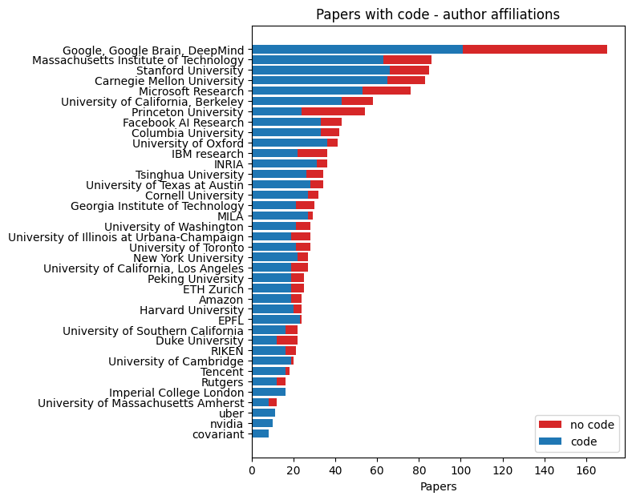

# AI conference analysis

This repository is for analysing code release trends from NeurIPS 2019.

In future, it may extend to other analysis.

## NeurIPS 2019 code release

It has been established that around 75% of papers accepted to NeurIPS 2019 released code. This analysis centres around the fraction of code released _per institution_. Therefore, extracting the institutions that authors are affiliated with (affiliations) is key.

Code release was determined by whether there is a link to code on the page for each paper in the proceedings [1].

Multiple methods of extracting affiliations have been tried.

- The most accurate is implemented in `affiliations_direct.ipynb`. It uses self-reported affiliations by authors in the initial list of papers [2].
- Named entity recognition on raw paper text is implemented in `affiliations_ner.py`. This picks up some true positives that are not in the self-reported data, but has some false positives and many more false negatives.
- Matching author names to Google Scholar profiles, implemented in `affiliations_scholar.py`. This was abandoned early because it was very slow and had too many false positives.

### Results

The main results are in `out/neurips_2019/`. The `code_rankings.txt` file summarises code release with a few different ranked lists, and `code_release_fraction_all.txt` lists the code release fraction and number of papers for every institution identified.

The `affiliations_direct.ipynb` notebook uses the current default data source and method of extracting author affiliations for each paper. It ends with some code release analysis for a select set of institutions.

### Caveats

In general the analysis is imperfect. At a high level, it overlooks underlying factors that influence the decision to release code.

For the named entity recognition method:

- Some papers (49 out of 1428) don't make it all the way through the pipeline due to a missing file, failed text conversion or uncommon formatting
- Some text information fails to be extracted correctly or detected at all

### Usage

Run `code_release_analysis.py` to replicate the analysis of NeurIPS 2019 code release, found in `out/neurips_2019/code_rankings.txt`. Requires `python >= 3.6`.

To go deeper and customise, see `environment.yml` for dependencies. The main ones are

- `python >= 3.6`
- `scrapy`
- `nltk`
- `scikit-learn`
- `spacy`
- `allennlp`

For the NER method, `bash code_release_pipeline.sh` will run the full pipeline. Getting the data and doing named entity recognition take a long time, so in practice you may want to run the steps separately.

## Acknowledgements

The raw data extracted from [2] is taken from this [repository by Diego Charrez](https://github.com/dcharrezt/NeurIPS-2019-Stats). The `affiliations_direct.ipynb` notebook is adapted from the `institutions_graph.ipynb` notebook in that repository.

## References

[1] [NeurIPS 2019 proceedings](https://papers.nips.cc/book/advances-in-neural-information-processing-systems-32-2019)

[2] [NeurIPS 2019 initial accepted papers](https://web.archive.org/web/20190906013341/https://neurips.cc/Conferences/2019/AcceptedPapersInitial)
